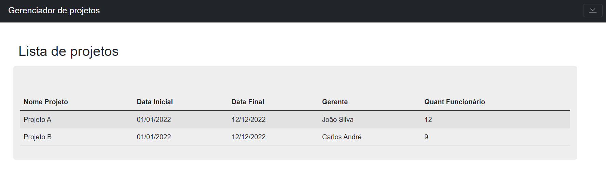

# Gerenciamento de Projetos

### 🚀 Como rodar o projeto:

### 1️⃣ Clone o repositório:
```
git clone https://github.com/erikasantanaa/gerenciamentoProjetos.git
```

### 2️⃣ Entre no repositório:
```
cd gerenciamentoProjetos
```

### 3️⃣ Instale as dependências:
```
npm install
```

### 4️⃣ Rode a aplicação:

```
npm run serve
```
---

⚡ Técnicas utilizadas:

- Componentes reutilizáveis.
- Comunicação entre componentes.
- Rotas. (Vue-Router)
- Gerenciamento de estados. (Vuex)
- Layout responsivo.
- Organização na arquitetura dos arquivos.
- Boas práticas de desenvolvimento.
- Clean Code.
